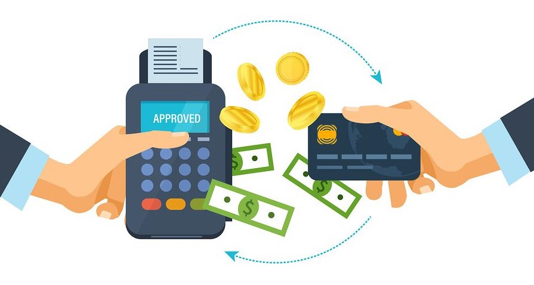
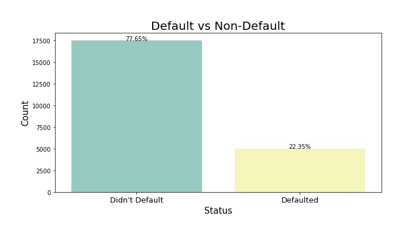
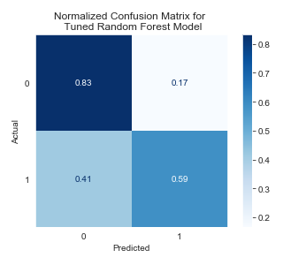

# Credit Card Default Prediction



## Overview

This project aims to build a classification model that can predict whether or not a customer will default on their credit card. From the perspective of risk management, understanding the customer characteristics that lead to this outcome can aid creditors in deciding reasonable credit limits to prevent this. After cleaning the data, handling class imbalance, feature engineering and tuning hyperparameters, the final Random Forest model achieved an F1 score of 0.5412.

## Data Understanding

The [dataset](https://archive.ics.uci.edu/ml/datasets/default+of+credit+card+clients) contains 22,499 rows of information on default payments, demographic factors, credit data, history of payment, and bill statements of credit card clients in Taiwan from April 2005 to September 2005.



The dataset had a class imbalance where only 22% of the customers defaulted on their payment.

### Cleaned Dataset

| Column Name | Description |
|-|-|
| max_credit_given | Amount of the given credit (NT dollar). it includes both the individual consumer credit and his/her family (supplementary) credit. |
| gender | 1 = male; 2 = female |
| education | 1 = graduate school; 2 = university; 3 = high school; 4 = others |
| marital_status | 1 = married; 2 = single; 3 = others |
| age | Age of customer in years. |
| pay_status_sept | Amount of monthly payment delay record, broken down from April to September 2006. These features include pay_status_aug, pay_status_july, pay_status_june, pay_status_may and pay_status_april. |
| bill_sept | Amount of bill statement (NT dollar). These features include bill_aug, bill_july, bill_june, bill_may, and bill_april. |
| payment_sep | Amount of previous payment (NT dollar). These features include payment_aug, payment_jul, payment_jun, payment_may and payment_april. |
| default | Whether or not they defaulted their payment. 1 = did default; 0 = did not default. |

The **measurement scale** for the repayment status is: 
- -1 = pay duly
- 1 = payment delay for one month
- 2 = payment delay for two months 
- [...]
- 8 = payment delay for eight months
- 9 = payment delay for nine months and above

## Methods

This is a binary classification problem where the target variable is whether or not a client will default on their payment (Yes = 1, No = 0). After cleaning the data, handling class imbalance and feature engineering, several baseline models were fit to the training data. Baselines included K Nearest Neighbors, Logistic Regression, Decision Trees and Random Forest. Each model iteration's hyperparameters were tuned with GridSearchCV. Predictions were evaluated using the **F1 Score**.

The final Random Forest model achieved an F1 score of 0.5412.



## Repository Contents
```bash
.
├── notebooks                          # contains modeling notebooks
├── pickle                             # contains models and scalers
├── visualizations                     # contains graphs and images
├── src                                # source folder
│   └── training_data.csv              # raw dataset
├── README.md                          # public-facing preview
└── final_notebook.ipynb               # final version of EDA, feature engineering and modeling process


```

## For More Information
- See the [full project overview](https://github.com/sidneykung/cc_default_prediction/blob/master/final_notebook.ipynb) in the `final_notebook.ipynb` Jupyter Notebook.
- For additional information or suggestions, contact Sidney Kung at [sidneyjkung@gmail.com](mailto:sidneyjkung@gmail.com)


**Let's connect!**

<a href="https://www.linkedin.com/in/sidneykung/" target="_blank"></a> <a href="https://twitter.com/sidney_k98" target="_blank"></a>
